# TaskManager

**TaskManager** is a secure, extensible backend system for managing user tasks, showcasing backend design and architecture best practices. It is built using modern Java technologies and is structured for scalability, maintainability, and production-readiness.

## System Architecture

The following diagram illustrates the high-level system architecture of the TaskManager application. It demonstrates how the different components interact to support task management, authentication, messaging, and CI/CD automation:

- Client interacts with the system via REST APIs exposed through an API Gateway.
- The TaskManager backend is a Spring Boot application structured with distinct modules for authentication and task management.
- Upon task completion, the application publishes events to Kafka, which are then consumed by a decoupled Notification Service for downstream processing.
- The backend interacts with a MySQL database for persistence.
- A complete CI/CD pipeline is established using GitHub, Jenkins, and Docker, enabling automated builds, testing, and deployments.
  

## Key Features

### 🔐 JWT-Based Security

Implements stateless authentication using **JSON Web Tokens (JWT)** with Spring Security. Users authenticate via a login endpoint and receive a signed JWT, which is then used to access protected resources. Role-based authorization ensures only permitted actions are executed per user role.

- Stateless session management
- Custom `JwtFilter` and `AuthenticationEntryPoint`
- Role-based access control with `@PreAuthorize` support

```mermaid
---
config:
  theme: redux-color
  look: classic
---
sequenceDiagram
    participant Client
    participant FilterChain
    participant AuthController
    participant AuthManager
    participant UserDetailService
    participant UserRepository
    participant JwtUtil
    participant TaskController
    Client->>FilterChain: 1. POST /auth/login {username, password}
    Note right of FilterChain: JwtFilter skips /auth/**
    FilterChain->>AuthController: Forward request
    AuthController->>AuthManager: 2. authenticate(username, password)
    AuthManager->>UserDetailService: 3. loadUserByUsername()
    UserDetailService->>UserRepository: 4. Load user by username
    UserRepository-->>UserDetailService: 5. Return UserDetails
    AuthManager->>AuthController: 6–7. Validate password, return success
    AuthController->>JwtUtil: 8. generateToken(username)
    JwtUtil-->>AuthController: 9. Return JWT
    AuthController-->>Client: Return JWT
    Client->>FilterChain: 10. GET /tasks (Authorization: Bearer <token>)
    FilterChain->>FilterChain: 11. JwtFilter extracts token
    FilterChain->>JwtUtil: 12. Validate token
    JwtUtil-->>FilterChain: Valid token
    FilterChain->>UserDetailService: 13–14. Load user from DB
    UserDetailService->>UserRepository: Find by username
    UserRepository-->>UserDetailService: Return User
    FilterChain->>FilterChain: 15. Set SecurityContext
    FilterChain->>TaskController: 16. Pass request (access checks passed)
    TaskController->>Client: 17. Return data

```



---

### 🔄 Kafka-Driven Messaging

Applies **Apache Kafka** to publish task completion events. This decouples the main application from secondary concerns like notifications, logging, or reporting, enabling asynchronous, scalable workflows.

- Kafka producer triggered on task completion
- Consumer service handles downstream processing
- Designed for extensibility with multiple subscribers


---

### 🛠️ Production-Ready CI/CD

The entire application is **Dockerized** and integrated with **Jenkins pipelines**. It includes automated steps for testing, image building, and deployment, simulating real-world deployment workflows.

- Dockerfiles and docker-compose for service orchestration
- Jenkinsfile for automated build/test/deploy
- GitHub integration for CI triggers
  

---

### 📝 Audit Logging via AOP

Utilizes **Spring AOP (Aspect-Oriented Programming)** to automatically log sensitive operations (e.g., task creation, deletion) without polluting business logic.

- Custom `@AuditLog` annotation
- Aspect intercepts annotated methods to persist or print logs
- Easily extendable to monitor additional actions


---

### ♻️ Task Deletion and Recovery

Supports soft deletion of tasks using a boolean `deleted` flag. Deleted tasks are hidden from normal queries but can be restored individually or in bulk.

- Soft-delete flag with `@SQLRestriction`
- Scheduled job cleans up old records
- Endpoints to restore tasks by ID or all at once


---

## Tech Stack

- **Backend**: Java 17, Spring Boot, Spring Security, Spring AOP
- **Persistence**: Hibernate (JPA), MySQL
- **Messaging**: Apache Kafka
- **DevOps**: Docker, Jenkins, Git
- **Utilities**: Lombok, MapStruct, Maven

## Package Structure

```
de.personal.taskmanager
├── annotation        # Custom annotations (e.g., @AuditLog)
├── aop               # Aspect-oriented audit logging
├── common            # Mappers and utility components
├── config            # Configuration classes (JPA, Security, Async)
├── controller        # RESTful controllers
├── dto               # Data transfer objects
├── exception         # Global and security-related error handling
├── message           # Kafka producers and consumers
├── model             # Entity definitions and enums
├── repository        # JPA repository interfaces
├── security          # JWT handling and filter config
├── service           # Business logic and implementations
```
